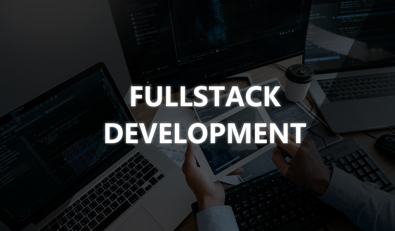
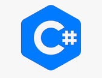

  

  

<h1 align="center">
</h1>

&nbsp;
Resourceful Software Engineer with over 7 years of experience in full-stack blockchain development and leading product cycle from conception to completion.
I want a successful outcome for your project even if it is not with me. I think every time a client succeeds here we all win. So even if you just want my opinion, I would be happy to give it.

## Experienced FullStack Development

<table>
  <tr>
    <td align="center" width="96">
      
       JavaScript
    </td>
    <td align="center" width="96">
      
       NodeJs
    </td>
    <td align="center" width="96">
      
       TypeScript
    </td>
    <td align="center" width="96">
      
       JQuery
    </td>
    <td align="center" width="96">
      
       TailwindCSS
    </td>
    <td align="center" width="96">
      
       Sass
    </td>
      <td align="center" width="96">
      
       React
    </td>
    <td align="center" width="96">
      
       Vue
    </td>
  </tr>
  <tr>
    <td align="center" width="96">
      
       Python
    </td>
    <td align="center" width="96"> 
      
       Docker
    </td>
    <td align="center"  width="96">
      
       MongoDB
    </td>
    <td align="center"  width="96">
      
       MySQL
    </td>
    <td align="center" width="96">
      
       Firebase
    </td>
    <td align="center" width="96">
      
       PostgreSQL
    </td>
    <td align="center" width="96">
      
       AWS_Amplify
    </td>
    <td align="center" width="96">
      
       Powershell
    </td>
  </tr>
  <tr>
      <td align="center" width="96">
        
         C#
      </td>
      <td align="center" width="96">
        
         Ethereum
      </td>
      <td align="center" width="96">
        
         Solidity
      </td>
  </tr>
</table>
